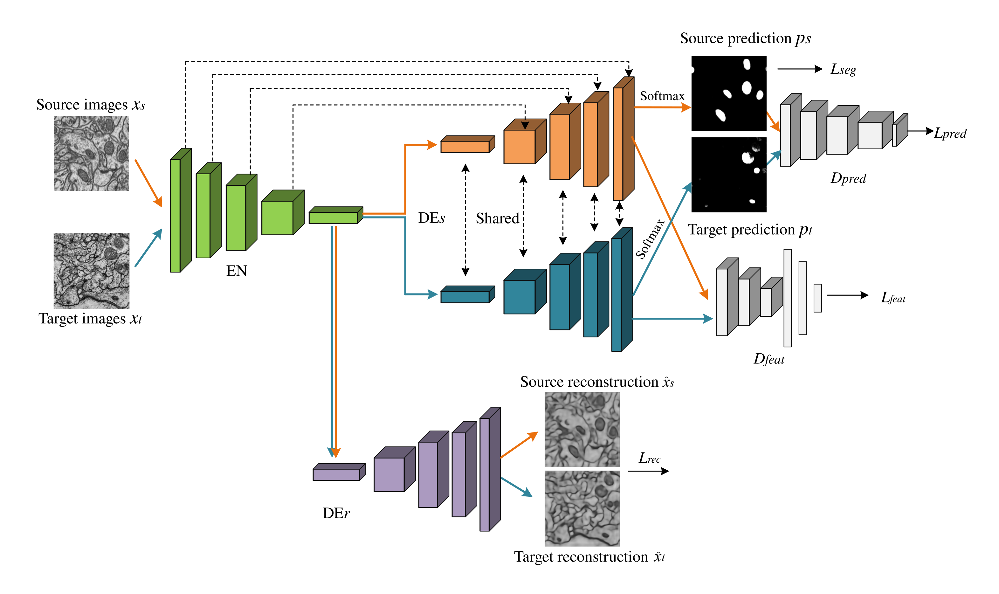

# Domain Adaptive Multi-Task Learning for Unsupervised Segmentation of EM Images

Here are implementations for paper: <br />

**Unsupervised Mitochondria Segmentation  in EM Images via Domain Adaptive Multi-Task Learning**. Jialin Peng, Jiajin Yi, Zhimin Yuan 
 
** Contact: Jiajin Yi (jiajin_yi@163.com)

## Network Structure

 

## Tested with Python 3.6

## Requirements
- CUDA 9.0 or higher
- PyTorch 1.1.0 
- torchvision 0.3.0 
- numpy 1.16.4
- albumentations 0.3.0

## Task
Unsupervised domain adaptive segmentation

## Dataset
* Source domain: [Drosophila III VNC EM images](https://gitub.com/unidesigner/groudtruth-drosophila-vnc) 
* Target domain:  [EPFL Mouse brain Hippocampus EM images](https://cvlab.epfl.ch/data/em)

## Training Data Augmentation
- Flip, Transpose, Rotate, RandomSizedCrop, Resize, RandomBrightnessContrast, MotionBlur, ElasticTransform

The data augmentation library [Albumentation](https://github.com/albumentations-team/albumentations)

## Training
Run `main.py` either in your favorite Python IDE or the terminal by typing:
```
python main.py
```
To obtain a more stable training process, we first train the segmentation network with the feature and label domain discriminators to get a better performance, and then jointly train the discriminators and the reconstruction network.

## Testing
* You can download the pretrained model[III_VNC_to_Mouse_Brain_Hipp_model](https://drive.google.com/file/d/1UGEkU6dYxtURfISm2KVwoBLGANW-KMtq/view?usp=sharing),which is trained on Drosophila III VNC dataset with labels(source domain) and Mouse Brain Hippocampus training subset without labels(target domain).
* Test the model
```
python prediction.py
```

## Acknowledgment
This code is heavily borrowed from [AdaptSegNet](https://github.com/wasidennis/AdaptSegNetand),[Y-Net](https://github.com/JorisRoels/domain-adaptive-segmentation) and [DANN](https://github.com/fungtion/DANN).

## Note
The model and code are available for non-commercial research purposes only.
